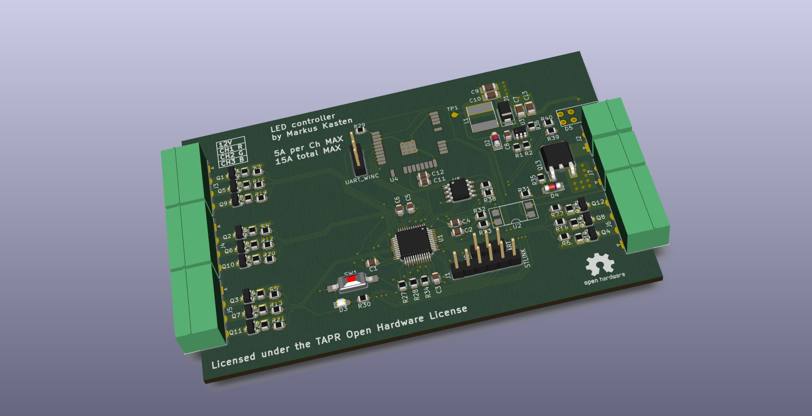

#  12 channel LED controller (hardware files)

This repository contains all KiCad project files for my LED controller project. More information about this project can be found on [Hackaday.io](https://hackaday.io/project/47190-12-channel-led-controller).

## Known issues (rev 1.0)

* The 3.3V rail is missing a backup supply (from a big cap for example) and 12-24V presence detection to keep the µC and EEPROM alive for a few more milliseconds after the power went away. It's currently not possible to save the EEPROM on powerdown and thus periodic or event based writes are required, wearing the EEPROM more than needed.
* The 5A/Ch rating does not seem realistic unless smoking hot FETs are okay :)

## License

This project is licensed under the [TAPR Open Hardware License](LICENSE.txt). A copy of the license is included in this repository.
